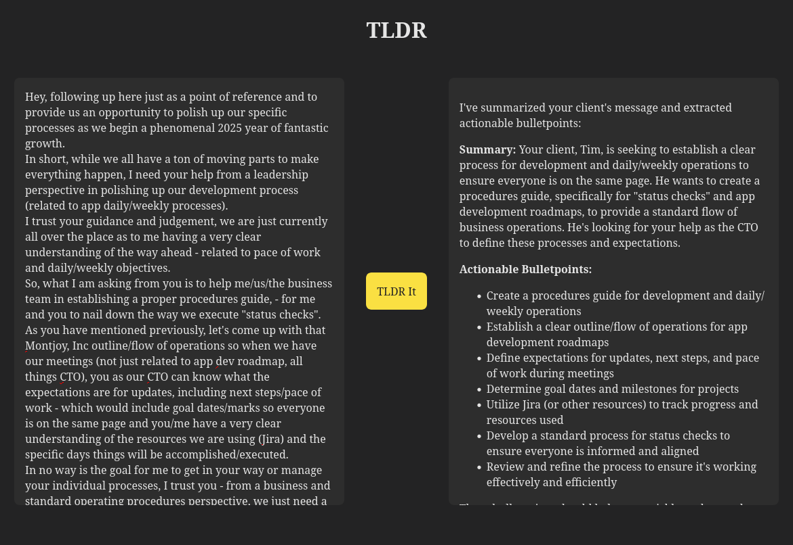

# TLDR

## Description

This project is a React-based web application called `TLDR` that provides a user-friendly interface for summarizing lengthy and potentially off-topic text messages. Users can input text into an editable div, and upon clicking a button, the application sends the text to the Groq API for summarization. The summarized content is then displayed using the react-markdown library. The project is configured with Vite for fast development and includes TypeScript for type safety. It also uses ESLint for code linting and follows a structured configuration for TypeScript and Vite.

## How to Use

1. Clone the repository: `git clone git@github.com:pallavsharma505/tldr.git`
2. Navigate to the project directory: `cd tldr`
3. Install the dependencies: `npm install`
4. Create a `.env` file in the root directory and add `VITE_GROQ_API_KEY="gsk_xxxxxx"`
5. Start the development server: `npm run dev`
6. Open the browser and navigate to `http://localhost:5173`
